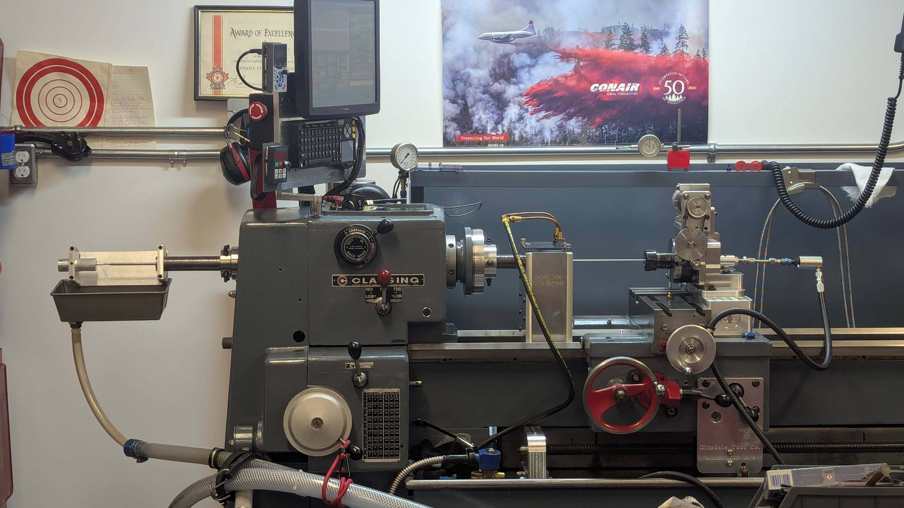
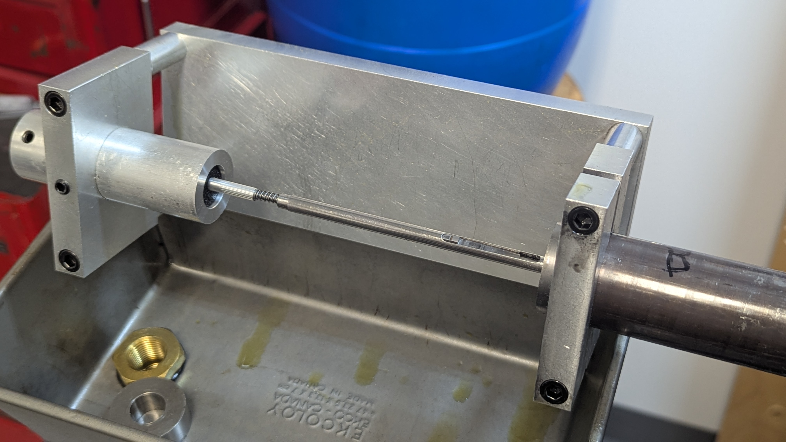
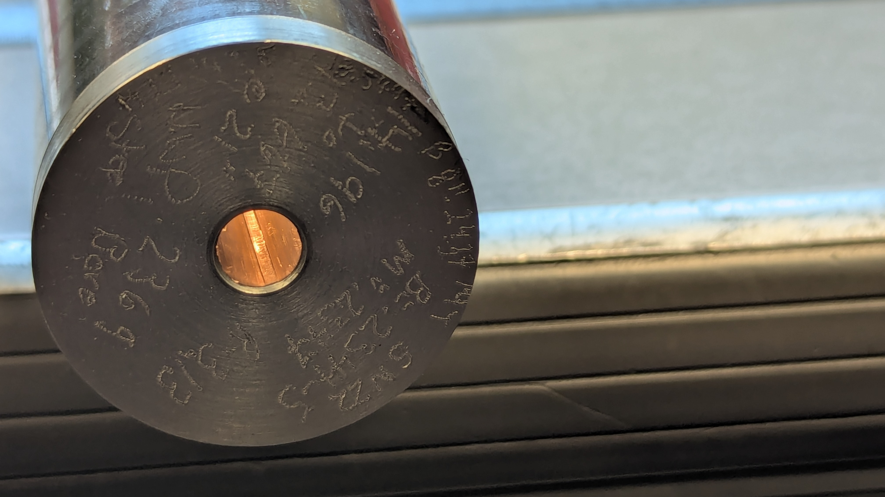
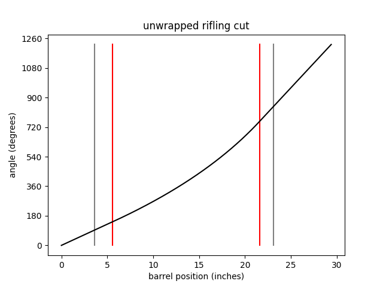

# gaintwist-rifling

G-code generator for a gain twist rifling machine. Typical rifling is cut with a constant twist rate. Gain twist rifling starts at a lower twist rate at the beginning of the barrel, accelerating to a faster twist toward the end. This ensures stable bullet flight (determined by the final twist rate), while reducing wear at the chamber of the barrel and smoothing out the torque applied to the bullet. 



A manual lathe was converted to CNC and adapted for rifling with the lathe's default Z-axis (linear travel of the rifling cutter) and a custom A-axis (rotational movement). Drilling and reaming are first performed with the barrel spinning in the lathe's spindle and the drill or reamer held fixed. After reaming, a fixture at the end of the lathe's headstock prevents the barrel from rotating during rifling cuts. The A-axis is used for both cutting the spiral rifling grooves and advancing the depth of the cutter, depending on its position along the Z-axis. 



A spring assembly is used to transition between rotation of the cutter and advancing the cut depth with a combination of Z- and A-axis movements. Pushing the Z-axis against the end of the machine applies sufficient friction to prevent rotation of the cutter. Instead, the assembly transmits the rotation of the A-axis to the translation of a wedge underneath the hook cutter, raising it relative to the cutter body and increasing the depth of subsequent cuts. Only a small amount of material can be removed in each cut: each advancement raises the cutter by only 1/10 of a thousandth of an inch (~0.0025mm). For example, a final rifling depth of 4 thou (~0.1mm) requires 40 cutting passes per groove.



A sample stub with rifling cut by the machine is shown above. A finished barrel is cut from a longer blank: for example, a 28 inch barrel blank will be fully rifled before being cut down, finished, and chambered at a final length of 21 inches. Extra sacrificial material at each end of the barrel ensures that imperfections at the entry/exit points during drilling and reaming are removed. In addition to this sacrificial material, the barrel blank also must be long enough to extend out of each end of the lathe's headstock.

# Installation

Download the repository with:
```
git clone https://github.com/efunn/gaintwist-rifling.git
```

There are minimal dependencies. If any libraries are missing, install them with:
```
pip install -r requirements.txt
```
from within the `gaintwist-rifling` folder.

# G-code generation

## Quickstart

The folder structure is as follows:

```
.
├── config
│   ├── demo.yml
│   ├── ...
│   └── sample_barrel_config.yml
├── gcode
│   ├── demo.nc
│   ├── ...
│   └── sample_barrel_gcode.nc
└── gaintwist.py
```

Create a `./config/_____.yml` file for your barrel specification.

Run the python script from the `gaintwist-rifling` folder:
```
python gaintwist.py
```

By default, you will be prompted for the name of the configuration file and output filename, and `./gcode/_____.nc` will be generated.

A set of command line arguments can be used to automate this process. For example:
```
python gaintwist.py -c sample_barrel_config -o sample_barrel_gcode
```
will use the `./config/sample_barrel_config.yml` configuration to generate `./gcode/sample_barrel_gcode.nc`.

## Configuration options

Use `./config/demo.yml` as the basis for your configuration files. Each value and their units are explained in the comments. Currently, linear and sinusoidal gain twist profiles are supported through different interpolation methods between the initial and final twist. Additional gain twist profiles can be added in the future as needed.

## Command line options

| Argument | Shortcut | Sample | Default |
| -------- | -------- | ------ | ------- |
| --config | -c | sample_barrel_config | None (prompts to enter) |
| --output | -o | sample_barrel_gcode | None (prompts to enter) |
| --message | -m | 'sample gcode comments' | None (prompts to enter) |
| --plot | -p | (outputs plot of cut) | False (no plotting) |

As mentioned in **Quickstart**, simply running `python gaintwist.py` will prompt for the necessary config file and output filename. Output of files is protected such that duplication and overwriting of files is prevented (except for the special case of `./gcode/demo.nc` or `-o demo`).

To include gcode comments at the top of your file, `-m` argument can be used (if not, a manual prompt will occur before gcode generation; if you simply press enter here then the comments section will be blank).

Plotting of a single rifling cut is enabled with the `-p` argument. The linear position in inches (X-axis on plot; Z-axis on machine) and rotational angle (Y-axis on plot; A-axis on machine) are shown as follows:



The black line indicates the rifling cutter's angular trajectory across the entire operation range (i.e. even when it extends beyond the length of the barrel blank). Grey vertical lines indicate the final desired cut rifling length after finishing. Red vertical lines surround the gain twist portion of the rifling; a constant twist is used before the first red line and after the second red line. In this example, there are 2 inches of constant rifling at the beginning of the barrel, and 1.5 inches of constant rifling at the end.